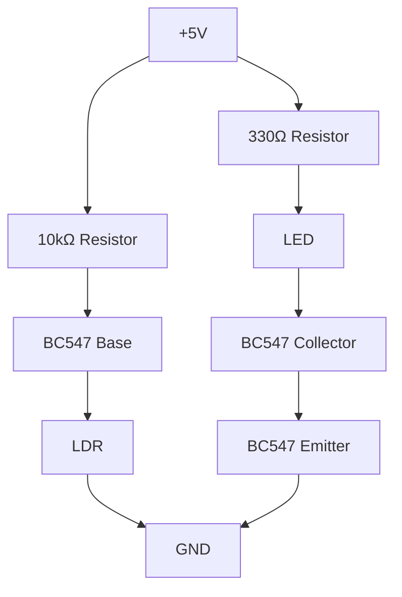

# Automatic-Night-Light-LDR
Designed and implemented an Automatic Night Light using an LDR and BC547 transistor. 
Developed a light-sensing voltage divider and transistor-based switching circuit that automatically turns an LED ON in darkness and OFF in bright light. 
Tested through hardware implementation and simulation.

# Automatic Night Light Using LDR

## Project Overview

This project automatically turns ON an LED during low-light conditions and turns it OFF when sufficient light is available. It uses an LDR (Light Dependent Resistor) for light sensing and a BC547 transistor as a switching device.

## Circuit Diagram

## Components Used

- LDR
- BC547 Transistor
- LED
- 330Ω Resistor
- 10kΩ Resistor
- Breadboard
- 5V Power Supply

## Working Principle

- In bright light, the LDR resistance is low, keeping the transistor OFF and the LED OFF.
- In darkness, the LDR resistance increases, turning the transistor ON and lighting the LED.

## Results

✅ Automatic light detection  
✅ LED OFF during daytime  
✅ LED ON during darkness  
✅ Successful hardware implementation

## Applications

- Automatic street lighting
- Garden lights
- Emergency lighting
- Smart home automation

## Future Enhancements

- Relay-controlled AC bulb
- Arduino-based smart lighting
- IoT-enabled monitoring system
- Solar-powered automatic night light

-
